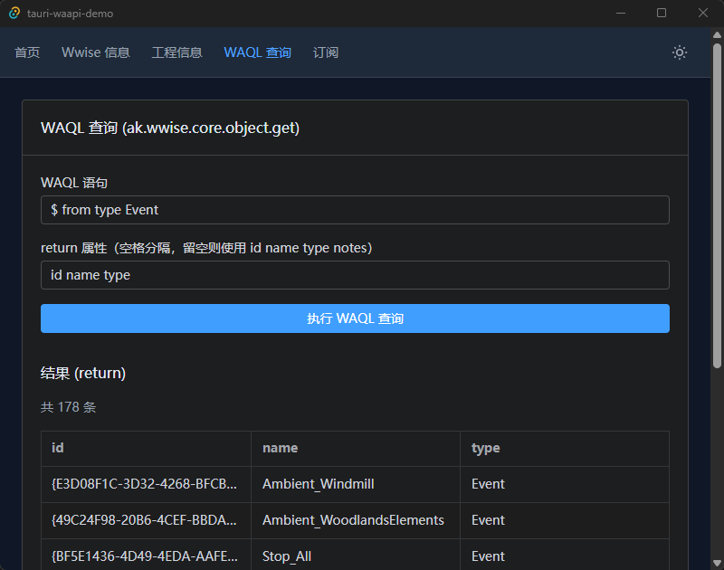

# Tauri WAAPI Demo

基于 Tauri 2 的桌面示例应用，通过 `waapi-rs` 连接本机运行中的 Wwise Authoring，演示以下能力：

- 获取 Wwise 基础信息（`ak.wwise.core.getInfo`）
- 获取当前工程信息（`ak.wwise.core.getProjectInfo`）
- 执行 WAQL 查询（`ak.wwise.core.object.get`）
- 订阅选中对象变化（`ak.wwise.ui.selectionChanged`）



## 技术栈

- 桌面层：Tauri 2
- 后端：Rust + `waapi-rs` + `tokio` + `serde`
- 前端：Vue 3 + TypeScript + Vite + Element Plus + Tailwind CSS

## 目录结构

```text
src/
  composables/
  features/waapi/
  layouts/
  router/
  views/

src-tauri/src/
  commands/
  state.rs
  waapi_client.rs
  lib.rs
```

## 前置条件

- 已安装 Rust、Node.js、pnpm、Tauri 2 运行依赖
- 已启动 Wwise 并打开工程

## 开发与构建

```bash
pnpm install
pnpm dev
pnpm tauri dev
```

```bash
pnpm build
pnpm tauri build
```

## 代码检查

```bash
pnpm check
```

`pnpm check` 会执行：

- `vue-tsc --noEmit`
- `cargo check --manifest-path src-tauri/Cargo.toml`

## 许可

MIT
